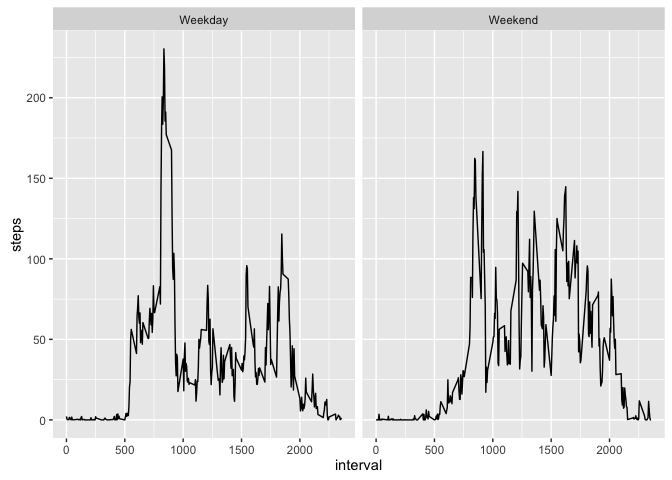

# Reproducible Research: Peer Assessment 1


## Loading and preprocessing the data


```r
ActData<-read.csv("~/Documents/LearningR/ReproducibleResearch/Project1/activity.csv",header=TRUE,na.strings="NA",stringsAsFactors = FALSE)
# Make sure that the date column is in date format
dateData<-as.Date(ActData$date,"%Y-%m-%d")
ActData$date<-dateData
```


## What is mean total number of steps taken per day?

1. Calculate the total number of steps taken per day

 Melt the data using reshape2

```r
library(reshape2)
meltedData<-melt(ActData,is=c("interval","date"),measure.vars="steps",na.rm=TRUE)
# This process gives us a summary of date and interval with the amount of steps as the value
head(meltedData)
```

```
##           date interval variable value
## 289 2012-10-02        0    steps     0
## 290 2012-10-02        5    steps     0
## 291 2012-10-02       10    steps     0
## 292 2012-10-02       15    steps     0
## 293 2012-10-02       20    steps     0
## 294 2012-10-02       25    steps     0
```

```r
castedData<-dcast(meltedData,date~variable,sum)
# This gives us the total number of steps per day
head(castedData)
```

```
##         date steps
## 1 2012-10-02   126
## 2 2012-10-03 11352
## 3 2012-10-04 12116
## 4 2012-10-05 13294
## 5 2012-10-06 15420
## 6 2012-10-07 11015
```

2. Make a histogram of the total number of steps taken each day

```r
hist(castedData$steps,main="Histogram of Total Steps per Day",xlab="Total Steps per Day")
```

 

 3. Calculate and report the mean and median of the total number of steps taken per day

```r
# we computed the mean and median of the total steps per day
mean(castedData$steps)
```

```
## [1] 10766.19
```

```r
median(castedData$steps)
```

```
## [1] 10765
```

## What is the average daily activity pattern?

 Make a time series plot (i.e. type="l") of the 5-minute interval (x-axis) and the average number of steps taken, averaged across all days (y-axis)

```r
meancastedData<-dcast(meltedData,interval~variable,mean)
# this casts the earlier dataset "meltedData" into the average of steps per interval
plot(meancastedData$interval,meancastedData$steps,type="l",xlab="step interval",ylab="average value")
```

 

Which 5-minute interval, on average across all the days in the dataset, contains the maximum number of steps?

```r
meancastedData[meancastedData$steps==max(meancastedData$steps),]
```

```
##     interval    steps
## 104      835 206.1698
```

```r
# That would be interval 835 with the maximum step of 206.2
```

## Inputting missing values

1. Calculate and report the total number of missing values in the dataset (i.e. the total number of rows with NAs)

```r
NainSteps<-is.na(ActData$steps)

### To compute the total number of NAs, we add the number of True statement up (since TRUE = 1 and FALSE = 0) 
sum(NainSteps)
```

```
## [1] 2304
```

```r
### It totaled into 2304 values that are missing in the dataset
```

2. Devise a strategy for filling in all of the missing values in the dataset.  The strategy does not need to be sophisticated. For example, you could use the mean/median for that day, or the mean for that 5-minute interval, etc.

The strategy: will use the average from the 5-minute interval taken in the 3rd portion of this project. However, I will round all the average into integer


3. Create a new dataset that is equal to the original dataset but with the missing data filled in.

Subset the data for all rows that are NAs

```r
NAdata<- ActData[NainSteps,]

# I merge the NAdata data set with the casted average interval value
ReplaceData<-merge(NAdata,meancastedData,by="interval")
# Delete the NA steps
ReplaceData$steps.x<-NULL
# Change the name
names(ReplaceData)<-c("interval","date","steps")
# Reorder the data
ReplaceData<-ReplaceData[c(3,2,1)]
# Put them as integer
ReplaceData$steps<-as.integer(ReplaceData$steps)

### Let's Remove all the NAs from the Original Data
# Subset the data that are without NAs
WONAData<-ActData[!is.na(ActData$steps),]
# Apppend the replacement data with the complete data
FinalData<-rbind(ReplaceData,WONAData)
# Reorder the data set by date
FinalData<-FinalData[order(FinalData$date,FinalData$interval),]
```

4. Make a histogram of the total number of steps taken each day and report the mean and median total number of steps taken per day. Do these values differ from the estimates from the first part of the assignment? What is the impact of inputing missing data on the estimates of the total daily number of steps?


```r
# Redo the process in the first question
FinalmeltedData<-melt(FinalData,is=c("interval","date"),measure.vars="steps",na.rm=TRUE)
FinalcastedData<-dcast(FinalmeltedData,date~variable,sum)
hist(FinalcastedData$steps,main="Histogram of Total Steps per Day",xlab="Total Steps per Day")
```

 

```r
mean(FinalcastedData$steps)
```

```
## [1] 10749.77
```

```r
### The mean is: 10749.77
median(FinalcastedData$steps)
```

```
## [1] 10641
```

```r
### The median is: 10641
```
From the first part, their mean and median were 10766.19 and 10765, respectively. The mean and median value after adding more data points decreased by 16.42 and 124 from the 1st part, respectively.

## Are there differences in activity patterns between weekdays and weekends?

1. Create a new factor variable in the dataset with two levels – “weekday” and “weekend” indicating whether a given date is a weekday or weekend day.

```r
# Let's create a dataset showing which days are weekdays and which days are weekends

DayoftheWeek<-c("Monday","Tuesday","Wednesday","Thursday","Friday","Saturday","Sunday")
WeekDayEnd<-c(rep("Weekday",5),rep("Weekend",2))
VariablesWeekDayEnd<-data.frame(DayoftheWeek,WeekDayEnd)
names(VariablesWeekDayEnd)<-c("WeekValue","WeekDayEnd")
VariablesWeekDayEnd
```

```
##   WeekValue WeekDayEnd
## 1    Monday    Weekday
## 2   Tuesday    Weekday
## 3 Wednesday    Weekday
## 4  Thursday    Weekday
## 5    Friday    Weekday
## 6  Saturday    Weekend
## 7    Sunday    Weekend
```

```r
# Let's put the label of what day is the date into the FinalData dataset
WeekValue<-weekdays(FinalData$date)
WDayFinalData<-cbind(FinalData,WeekValue)

# We will then merge the two data frames by the common variable "WeekValue"
WdayAllData<-merge(WDayFinalData,VariablesWeekDayEnd,by="WeekValue")
# str(WdayAllData)
# I deleted the weekvalue column here
WdayAllData$WeekValue<-NULL
```

2. Make a panel plot containing a time series plot(i.e. type="l") of the  5-minute interval (x-axis) and the average number of steps taken averaged across all weekdays days or weekend days (y-axis).


```r
# melt the just-created data with respect to interval, date and the weekend/weekday variable with respect to the steps taken
WdaymeltedData<-melt(WdayAllData,is=c("interval","date","WeekDayEnd"),measure.vars="steps")
# cast the data with respect to their average steps
WdaymeancastedData<-dcast(WdaymeltedData,interval+WeekDayEnd~variable,mean)
# plot the data based on whether it's weekend of weekday
library(ggplot2)
ggplot(WdaymeancastedData,aes(x=interval,y=steps))+geom_line()+facet_grid(.~WeekDayEnd)
```

 
